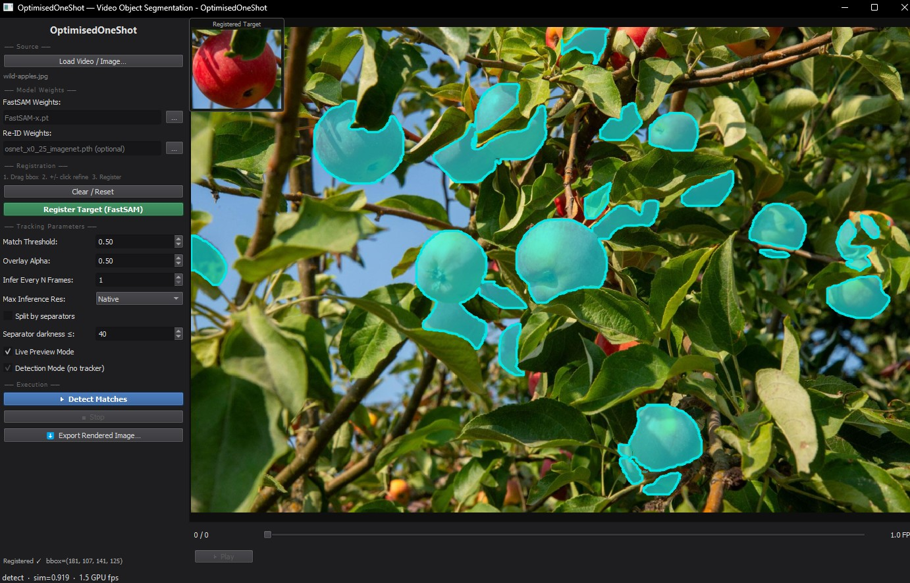
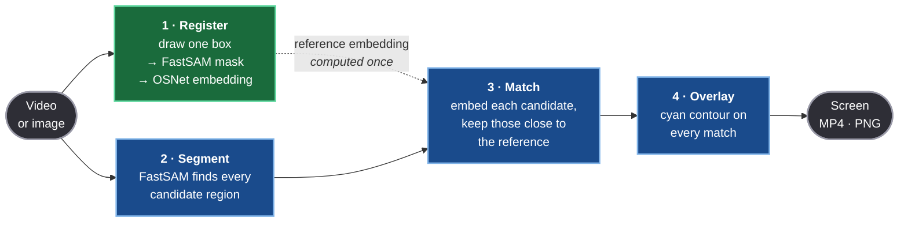
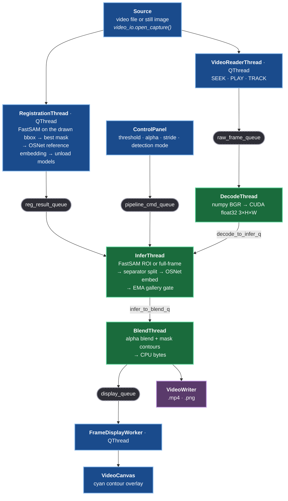
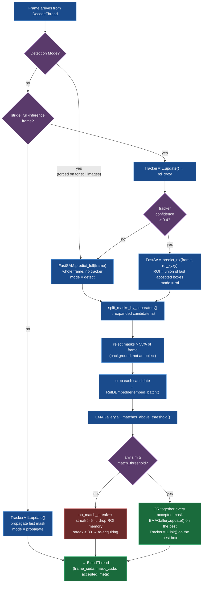

# OptimisedOneShot — One-Shot Video Object Segmentation

Desktop application for real-time, one-shot video object segmentation on a single consumer GPU.

The user draws a bounding box around a target object on a paused frame; FastSAM generates candidate masks inside that box; the best mask is selected (optionally refined with positive/negative point clicks); a Re-ID embedding is computed; then a lightweight FastSAM + OSNet tracking pipeline follows the target across all remaining frames. The mask overlay is rendered in **cyan** throughout.



*One shot, one click: a single apple is registered (thumbnail, top-left) and every other region in the image matching that appearance is segmented. Overlays trace the true mask contour.*

---

## Confirmed Environment

| Package | Version |
|---|---|
| Python | 3.11 |
| PyTorch | 2.12.0+cu132 |
| CUDA | 13.2 |
| torchvision | 0.27.0 |
| PyQt5 / qtpy | 5.15.11 / 2.4.3 |
| OpenCV | 4.13.0 |
| Ultralytics | 8.4.14 |
| ffmpeg-python | 0.2.0 |

**GPU:** RTX 3070, 8.59 GB VRAM total

**Absent packages (fallbacks activate automatically):**
- `decord` → video decode falls back to `cv2.CAP_MSMF` (Windows Media Foundation)
- `torchaudio` → same fallback
- `triton` → `torch.compile` is skipped entirely; models run in eager mode

`torchreid` 1.4.0 **is** installed (from the vendored `deep-person-reid/` source, with
`pip install --no-deps --no-build-isolation .` — its own `requirements.txt` would otherwise
pull `numpy`/`opencv-python`/`tb-nightly` and disturb the pinned versions above). Re-ID
therefore runs on **OSNet-x0.25**; the ResNet18 `fc=nn.Identity()` path is fallback only.

---

## Running

```bash
pip install -r requirements.txt
python main.py
```

ffmpeg must be on `PATH` for NVENC/libx264 video export. Without it, `cv2.VideoWriter(mp4v)` is the fallback and still produces a valid `.mp4`.

**SAM2 is no longer used.** The `sam2` package and `sam2.1_hiera_large.pt` checkpoint are not required.

---

## Project Structure

```
OptimisedOneShot/
├── main.py       # Entry point: multiprocessing bootstrap, queue creation, Qt app
├── gui.py        # All Qt classes: VideoCanvas, ControlPanel, TimelinePanel,
│                 # RegistrationThread, VideoReaderThread, FrameDisplayWorker,
│                 # MainWindow
├── pipeline.py   # GPUPipelineProcess, DecodeThread, InferThread, BlendThread,
│                 # split_masks_by_separators(), _alpha_blend()
├── models.py     # HeavySAMRegistrar (legacy/unused), FastSAMTracker,
│                 # ReIDEmbedder, EMAGallery, TrackerWrapper,
│                 # _pick_best_fastsam_mask()
└── video_io.py   # NVDECReader (5-backend cascade), VideoWriter (NVENC fallback)
```

---

## Architecture Overview

### The Pipeline

Register a target **once**, then every frame is segmented, matched against that
single reference, and overlaid.



🟩 runs **once**, at registration · 🟦 runs **per frame**

| Step | Does | Key call |
|---|---|---|
| 1 · Register | Turns one user-drawn box into a 512-d appearance vector | `RegistrationThread` |
| 2 · Segment | Proposes candidate regions — ROI around the tracker, or the whole frame in Detection Mode | `FastSAMTracker.predict_roi` / `predict_full` |
| 3 · Match | Cosine-compares every candidate to the reference; keeps all above Match Threshold | `EMAGallery.all_matches_above_threshold` |
| 4 · Overlay | OR's the accepted masks, alpha-blends cyan, traces contours | `BlendThread` |

<details>
<summary><b>Detailed thread &amp; queue topology</b> — click to expand</summary>

One frame flows top to bottom. 🟦 **blue** = main process · 🟩 **green** = GPU process ·
⬛ **dashed** = `mp.Queue` process boundary · 🟪 **purple** = file output.

**Only CPU bytes cross a dashed node — CUDA tensors never do.**



| Stage | Thread | Input → Output |
|---|---|---|
| Read | `VideoReaderThread` (QThread) | file → `raw_frame_queue` |
| Register | `RegistrationThread` (QThread) | bbox + points → reference embedding (512-d, L2-normalised), then unloads all models |
| Decode | `DecodeThread` | numpy BGR → CUDA float32 `3×H×W` in `[0,1]` |
| Infer | `InferThread` | frame → candidate masks → embeddings → accept/reject vs EMA gallery |
| Blend | `BlendThread` | frame + accepted masks → cyan composite → `display_queue` / `VideoWriter` |
| Display | `FrameDisplayWorker` (QThread) | `display_queue` → `QPixmap` → canvas |

CUDA is initialised inside `GPUPipelineProcess.run()`, never in `__init__`, and
`os.environ['_OPTSHOT_GPU_PROC'] = '1'` is set before any model loads.

**Cross-process queues** (CPU data only — CUDA tensors never cross):

| Queue | maxsize | Payload |
|---|---|---|
| `raw_frame_queue` | 4 | `(frame_idx: int, frame_bgr: np.uint8 H×W×3)` |
| `reg_result_queue` | 1 | `{mask, bbox, reid_emb, score, frame_bgr, frame_idx}` |
| `pipeline_cmd_queue` | 8 | `_PipelineCmd(type, payload)` |
| `display_queue` | 3 | `(raw_bytes: bytes, W, H, frame_idx, meta: dict\|None)` |

**`pipeline_cmd_queue` command types:**
`STOP` · `UPDATE_THRESHOLD` · `UPDATE_ALPHA` · `UPDATE_STRIDE` · `UPDATE_SEP_SPLIT` · `UPDATE_SEP_THRESH` · `UPDATE_DETECTION_MODE`

</details>

---

## User Workflow

1. **Load Video** — opens `cv2.VideoCapture`; first frame displayed; scrubbing enabled.
2. **Draw Bounding Box** — left-click drag on the canvas to rubber-band a box around the target. A dashed cyan rectangle appears live as you drag. Minimum 5×5 px to register.
3. **Optionally Refine** — after the box is drawn, left-click adds positive points (green dots), right-click adds negative points (red dots). These hint `_pick_best_fastsam_mask()` toward the correct candidate and `_isolate_clicked_component()` to cut along separator lines.
4. **Register Target** — `RegistrationThread` runs FastSAM on the bbox ROI → selects best mask → applies separator isolation if positive points present → extracts Re-ID embedding. A **cyan mask overlay** and a **thumbnail** (top-right of canvas) confirm what was registered.
5. **Start Live Preview** — spawns `GPUPipelineProcess`; **cyan mask** tracks target at video FPS.
6. **Export** — batch-renders entire video with mask composite to `.mp4`.

**To re-register:** click "Clear / Reset" (resets bbox + points + mask overlay), then draw a new box.

---

## Critical Constraints

1. **CUDA tensors never cross `mp.Queue` boundaries.** Convert to CPU numpy bytes before enqueue; reconstruct on the GPU side.
2. **CUDA is never initialised in the main process.** No `import torch` at module level in `main.py` or `gui.py`. `preload_torch_dlls()` in `main.py` does `import torch` once on the main thread for the Windows DLL side effect only — this does NOT create a CUDA context.
3. **`GPUPipelineProcess.__init__` must not shadow `BaseProcess._config`.** Python's `mp.Process` stores internal state (`authkey`, `semprefix`, `daemon`) in `self._config`. The pipeline config dict is stored as `self._pipeline_cfg`. Shadowing `_config` breaks `torch.compile`'s inductor backend with `KeyError: 'semprefix'`.
4. **`_OPTSHOT_GPU_PROC` environment variable** is set to `'1'` by `GPUPipelineProcess.run()` before any model loads. `_compile_safe()` in `models.py` checks this to prevent `torch.compile` from running in the child process (which causes `BackendCompilerFailed: KeyError: 'semprefix'`).
5. **`torch.compile` requires Triton.** Not installed in this environment. `_compile_safe()` checks `_triton_available()` and the env var — both must pass for compilation to run. Models always fall back to eager mode here.
6. **`cv2.TrackerCSRT_create()` was removed in OpenCV 4.10.** Use `cv2.TrackerMIL_create()` unconditionally. TrackerMIL also requires a 1px margin from all frame edges for negative sample drawing — `TrackerWrapper._sanitize_bbox()` enforces this.
7. **`cv2.VideoWriter('avc1')` false-positive on Windows.** Without `openh264.dll`, `isOpened()==True` but the file is empty. `VideoWriter._try_cv2()` tries `mp4v` first (always works), then `avc1` only as an upgrade.
8. **Mixed precision:** `torch.autocast(device_type='cuda', dtype=torch.float16)` is used (not `.half()`) to keep sigmoid/softmax in fp32 while running the bulk of the model in fp16.
9. **`mp.Queue` feeder threads block Python exit.** `closeEvent` calls `q.cancel_join_thread()` on all queues, then `join()` the GPU process after `terminate()`.
10. **FastSAM and Re-ID never coexist during tracking.** In `RegistrationThread`, `fast_sam.unload()` (del + `empty_cache()`) fires before `ReIDEmbedder.load()`. In the GPU pipeline, both are loaded together but are small enough to coexist (~0.7 GB total vs 8.59 GB VRAM).

---

## Model Weights

| Model | File | Size | How obtained |
|---|---|---|---|
| FastSAM-s | `FastSAM-s.pt` | ~23 MB | Auto-downloaded via Ultralytics on first use |
| OSNet x0.25 | `osnet_x0_25_imagenet.pth` | ~3 MB | Optional — ResNet18 fallback if absent |

All `*.pt` and `*.pth` files are gitignored. SAM2 is no longer needed.

---

## Key Classes

### `gui.py`

| Class | Role |
|---|---|
| `VideoCanvas` | QGraphicsView — letterboxed video, rubber-band bbox drawing, +/- point prompts, cyan mask overlay, dashed cyan bbox rect, embedding thumbnail top-right |
| `TimelinePanel` | Frame slider, Play/Pause, FPS readout, export progress bar |
| `ControlPanel` | Sidebar: FastSAM/Re-ID paths, register/track/export controls, match threshold, overlay alpha, stride, separator-split toggle + threshold spinbox |
| `RegistrationThread` | QThread — FastSAM load → predict_roi(bbox) → pick best mask → isolate component → Re-ID embed → unload; emits `registration_done` |
| `VideoReaderThread` | QThread — cv2.VideoCapture; modes SEEK/PLAY/START_TRACKING/STOP_TRACKING; batch mode (export) never drops frames |
| `FrameDisplayWorker` | QThread — drains `display_queue`; emits `frame_ready(bytes, W, H, idx)` and `metadata_ready(dict)` |
| `MainWindow` | Orchestrator — state machine, wires signals, spawns/stops GPU process, watchdog timer |

**`VideoCanvas` registration state machine:**
- `_reg_bbox is None` + left-drag → draw bbox (phase 1)
- `_reg_bbox is not None` + left-click → positive point (phase 2)
- `_reg_bbox is not None` + right-click → negative point (phase 2)
- `clear_prompts()` resets both bbox and points

**`RegistrationThread.__init__` signature:**
```python
RegistrationThread(video_path, frame_idx, bbox, points,
                   fastsam_weights, reid_weights,
                   separator_thresh=40, parent=None)
```

### `models.py`

| Class/Function | Role |
|---|---|
| `HeavySAMRegistrar` | SAM2 Large fp16 wrapper — **NOT used for registration anymore** but class is kept; `_isolate_clicked_component()` static method is still called by `RegistrationThread` |
| `FastSAMTracker` | Ultralytics FastSAM-s; `load()`, `unload()`, `warmup()`, `predict_roi(frame_bgr, roi_xyxy)`, `predict_full(frame_bgr)` |
| `ReIDEmbedder` | OSNet-x0.25 (torchreid) with ResNet18 fallback; `embed(crop_bgr)` → `(D,)` float32 L2-normalised; `embed_batch(crops)` → `[N, D]` |
| `EMAGallery` | Thread-safe reference embedding; EMA update only when `sim > ema_threshold (0.92)`; `best_match()` → `(idx, sim)` |
| `TrackerWrapper` | cv2.TrackerMIL; `_sanitize_bbox()` enforces 1px inset from edges; `update()` catches opaque `cv2.error` and degrades gracefully |
| `_pick_best_fastsam_mask()` | Module-level function — selects best FastSAM candidate from a list of CUDA masks given user bbox + optional point hints. Priority: positive-point hits → negative-point rejection → IoU with bbox → largest area |

**`HeavySAMRegistrar._isolate_clicked_component(mask_bool, frame_bgr, points, separator_thresh)`** — static method, no model load required. Cuts the mask along near-black separator lines, runs connected-components, returns only the component under the first positive click.

### `pipeline.py`

| Class/Function | Role |
|---|---|
| `GPUPipelineProcess` | `mp.Process(daemon=True)` — stores config as `_pipeline_cfg` (NOT `_config`); sets `_OPTSHOT_GPU_PROC=1` in `run()` |
| `DecodeThread` | `raw_frame_queue` → `.cuda()` → CUDA float32 3×H×W normalised `[0,1]` → `decode_to_infer_q` |
| `InferThread` | TrackerMIL bbox → FastSAM ROI → `split_masks_by_separators()` → Re-ID embed → EMA gallery match → gate → blender queue |
| `BlendThread` | `_alpha_blend(frame_cuda, mask_cuda, alpha)` (**cyan** BGR `[1,1,0]`) → `.cpu().numpy().tobytes()` → `display_queue`; batch export writes to `VideoWriter` |
| `split_masks_by_separators()` | Module-level — cuts each CUDA mask along near-black pixels, runs `cv2.connectedComponentsWithStats`, expands list by splitting merged masks |
| `_alpha_blend()` | GPU composite — cyan overlay (`B=1, G=1, R=0` in BGR tensor) at configurable opacity |

**`_CONFIG_DEFAULTS` (GPUPipelineProcess):**
```python
{
    "match_threshold": 0.85,    # EMA gallery cosine threshold
    "ema_threshold":   0.92,    # EMA update gate (stricter than match)
    "ema_alpha":       0.90,    # EMA momentum
    "overlay_alpha":   0.50,    # cyan mask opacity
    "stride":          1,       # run FastSAM every N frames
    "fastsam_weights": "FastSAM-s.pt",
    "reid_weights":    None,
    "batch_render":    False,
    "output_path":     "",
    "video_path":      "",
    "vid_w": 1280, "vid_h": 720,
    "video_fps":       30.0,
    "total_frames":    0,
    "separator_split":         True,   # split touching objects at black lines
    "separator_thresh":        40,     # pixel intensity <= this = separator
    "min_component_area_frac": 0.30,   # drop components < 30% of registered area
}
```

**Registration result dict** (emitted by `RegistrationThread`, consumed by `GPUPipelineProcess`):
```python
{
    "mask":      np.uint8 H×W (0 or 255),
    "bbox":      (x, y, w, h) int xywh,
    "reid_emb":  np.float32 (512,) L2-normalised,
    "score":     float (1.0 from FastSAM path),
    "frame_bgr": np.uint8 H×W×3,
    "frame_idx": int,
}
```

### `video_io.py`

| Class | Role |
|---|---|
| `NVDECReader` | 5-backend cascade: torchaudio NVDEC → decord GPU → cv2 CAP_MSMF (active) → cv2 CAP_FFMPEG → cv2 default |
| `VideoWriter` | NVENC → libx264 → cv2 mp4v. `mp4v` tried first in the cv2 fallback — `avc1` requires openh264 DLL which is absent |

---

## Separator-Split Algorithm

Designed for grayscale video where objects are separated by distinct near-black lines, no objects overlap, and all objects are roughly the same size as the registered target.

**At registration time** (`RegistrationThread._run_inner` → `HeavySAMRegistrar._isolate_clicked_component`):
1. Build a separator mask: pixels with grayscale value `<= separator_thresh` (default 40).
2. Dilate by 3×3 kernel once to close anti-aliased gaps.
3. Zero out separator pixels in the FastSAM mask.
4. Run `cv2.connectedComponents(connectivity=8)`.
5. Keep only the component containing the first positive click point (or the largest component if the click landed on a separator pixel).

**Per-frame during tracking** (`InferThread._process_frame` → `split_masks_by_separators`):
1. Same separator mask + dilation.
2. For each FastSAM candidate mask: zero separator pixels, run `connectedComponentsWithStats`.
3. Drop components smaller than `min_component_area = max(64, registered_area * 0.30)`.
4. If ≤1 component survives: keep original mask unchanged (safe fallback).
5. Otherwise: emit one CUDA mask + xyxy bbox per surviving component — the Re-ID gallery then picks the one closest to the registered embedding.

**Live-tunable controls** (no restart needed):
- "Split by separators" checkbox → `UPDATE_SEP_SPLIT` command → `live_cfg["separator_split"]`
- "Separator darkness ≤" spinbox (0–120, default 40) → `UPDATE_SEP_THRESH` command → `live_cfg["separator_thresh"]`

---

## VideoReaderThread Modes

| Mode | Triggered by | Behaviour |
|---|---|---|
| SEEK | Slider release | Seek to frame, emit `preview_frame` once |
| PLAY | Play button | Continuous sequential read at video FPS, emit `preview_frame` per frame |
| START_TRACKING (live) | `start_tracking(start, batch=False)` | Push to `raw_frame_queue`, drop if full, pace at video FPS |
| START_TRACKING (export) | `start_tracking(0, batch=True)` | Push every frame with 30s blocking timeout, no FPS pacing |
| STOP_TRACKING | Stop button / end-of-video | Send `None` sentinel to `raw_frame_queue` |

**Export flow:** `_on_export()` → `_launch_gpu_process(batch_render=True, output_path=...)` → `start_tracking(0, batch=True)` → watchdog timer (5 s interval checks GPU process liveness) → `BlendThread` writes each frame to `VideoWriter` → emits `export_pct` in metadata → `_on_metadata_ready` closes when pct ≥ 100.

---

## Known Bugs Fixed in This Codebase

| Bug | Root Cause | Fix |
|---|---|---|
| `BackendCompilerFailed: KeyError: 'semprefix'` | `GPUPipelineProcess.__init__` stored pipeline config as `self._config`, shadowing `BaseProcess._config` (which holds `authkey`, `semprefix`, `daemon`). `_compile_safe()` saw `daemon=False` → allowed `torch.compile` → inductor called `tqdm` → `mp.RLock()` → crash | Renamed to `self._pipeline_cfg`; added `_OPTSHOT_GPU_PROC` env var as independent guard |
| `cv2.error: !negSamples.empty()` in TrackerMIL | Registration bbox was full-frame `(0,0,W,H)` with no background margin | `TrackerWrapper._sanitize_bbox()` clamps to 1px inset from all edges; `init()` catches `cv2.error` |
| Export stuck at 0% / empty file | (1) `avc1` codec on Windows reports open but encodes nothing; (2) `total_frames` probe returned 0 in GPU process; (3) frame drops during export; (4) no watchdog during export | (1) Try `mp4v` first; (2) pass `total_frames` from main process; (3) `batch=True` blocking put; (4) `_watchdog.start(5000)` in `_on_export()` |
| `TritonMissing` on first inference | `torch.compile` defers backend errors to first forward pass | `_compile_safe()` checks `_triton_available()` before compiling |
| `torch` DLL crash on secondary thread | Windows DLL search path mutation in `torch.__init__._load_dll_libraries()` is not thread-safe | `preload_torch_dlls()` called in `main()` before any QThread starts |
| Process not closing on exit | `mp.Queue` feeder threads kept process alive | `q.cancel_join_thread()` + `gpu_process.join()` after `terminate()` in `closeEvent` |
| `TrackerCSRT` removed | OpenCV 4.10+ dropped it | All code uses `cv2.TrackerMIL_create()` |
| Slider seek stale value | `_pending_seek_value` not updated on drag | Captured in `_on_slider_released` from `self.slider.value()` |
| Two adjacent objects merged into one mask | FastSAM spans both objects; single mask → single Re-ID crop → wrong match | `split_masks_by_separators()` cuts along black separator lines, `connectedComponents` splits into separate candidates |

---

## InferThread Decision Flow (per frame)



> **Note** — every accepted candidate is highlighted, not just the best one. The
> masks are OR'd into a single overlay, so one registered target can reveal many
> matching objects in the same frame.

---

## Adding New Live-Tunable Parameters

1. Add key + default to `_CONFIG_DEFAULTS` in `pipeline.py`.
2. Seed it into `live_cfg` in `_run_pipeline()`.
3. Add `UPDATE_<NAME>` handler in the command loop (`elif cmd.type == ...`).
4. Add widget to `ControlPanel._build_ui()` + signal + getter.
5. Wire signal in `MainWindow._connect_signals()` → handler that calls `_send_pipeline_cmd("UPDATE_<NAME>", value)`.
6. Add the key to the `config` dict in `_launch_gpu_process()`.
